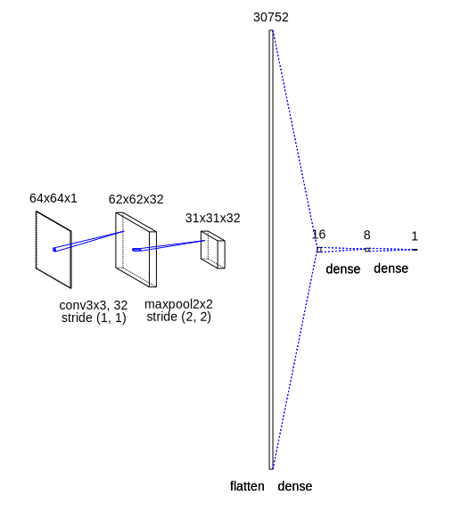

# Project Description

The following project was done in my machine learning class and consisted of fine-tuning parameters for several different machine learning algorithms and finding which ones lead to the best mean F1 score on the train and test splits of the dataset. The overall dataset consisted of 13,233 64x64 grayscale images. Binary classification was done using two sets of labels. The first set of labels determined whether or not an image was of George Bush and the second set of labels determined whether or not an image was of Serena Williams. The project was split into 4 phases and work was done in a separate jupyter notebook for each of the phases. The notebooks for each phase are available in the repo. The work done in each phase is described below.

## Phase 1

During phase 1 of the project, three-fold cross validation was performed on both the “Bush”
dataset and the “Williams” dataset. The two classifiers used in this phase were the
KNeighborsClassifier and the SVC. For the KNeighborsClassifier, three specific values for the
n_neighbors parameters were used: 1, 3, and 5. For SVC, I experimented with several different
kernels and several different values for C, degree, and gamma. The tables below lists the results
I obtained on both datasets for F1, precision, and recall on each fold of the cross validation and
the mean result of each for the KNeighborsClassifier with n_neighbors = 1,3,5 and the
parameters that gave me the best results for the SVC along with the F1, precision, and recall
values I obtained using SVC with those parameters.

From the above data, it is clear that n_neighbors = 1 for the KNeighborsClassifier yields the best value for mean F1 across the three folds of cross validation compared to n_neighbors = 3 and n_neighbors = 5. This is true for both the Bush dataset and the Williams dataset. The best mean F1 for the Bush dataset was about 0.1509 and the best mean F1 for the Williams dataset was 0.1770. For SVC, the two datasets differed in terms of which parameters yielded the best results for mean F1. Using SVC with a polynomial kernel of degree 2, a C value of 0.1, and a gamma of 1 yielded a mean F1 value of about 0.6498 for the Bush dataset while a linear kernel and a C value of 0.1 yielded a mean F1 value of about 0.5525 for the Williams dataset, both of which were the highest mean F1 values for each respective dataset.

## Phase 2

During phase 2 of the project, dimensionality reduction was applied to both the Bush and
Williams datasets using principal component analysis (PCA) in order to observe whether or not
it would help with increasing the mean F1 score while using the KNeighborsClassifier with
n_neighbors=1, which yielded the best result in phase 1, and SVC with a linear kernel and a C
value of 0.1 for the Williams dataset and SVC with a polynomial kernel of degree 2, a C value of
0.1, and a gamma value of 1 for the Bush dataset, which were also the best parameters for each
respective dataset from phase 1. The two tables below list the parameters for PCA that yielded
the best results for both the Bush and Williams datasets.

For this phase, I experimented with 12 different values for n_components ranging from 21 to
212, increasing by a power of 2 each time, and changed the value of whiten. After the
experiment, I discovered that an n_components value of 256 with whiten set to true yielded a
mean F1 value of 0.1563 for the Bush dataset and 0.2052 for the Williams dataset using the
KNeighborsClassifier and an n_components value of 256 with whiten set to false yielded a
mean F1 value of 0.2336 for the Bush dataset and 0.4059 for the Williams dataset using SVC.
The parameters that I found to be best for PCA were consistently the best for both of the
datasets.

## Phase 3

For phase 3 of the project, I developed a Convolutional Neural Network (CNN) in order to further try to increase the mean F1 values obtained from classification on the Bush and Williams datasets. The image below depicts the structure of the CNN used for both of the datasets:

The first layer is a 2D convolutional layer with 32 output filters and a 3x3 kernel with a stride of 1. The activation function for this layer is ReLU. The next layer is a 2D max pooling layer with a 2x2 pool size and a stride of 2. The following layer is a flatten layer used to transform the output into a 1D vector so that it can be used in the two fully connected (dense) layers to follow. The first dense layer has 16 neurons and ReLU for its activation function. The second dense layer has 8 neurons and also has ReLU for its activation function. Finally, the last dense layer is the output layer with 1 neuron and a sigmoid activation function. 

After compiling the CNN, I did a train and test split with a test size of 1/3 on both of the datasets in order to prepare for fitting the data to the CNN. Although three-fold cross validation would have been the better choice here, it would require more computing power than what is readily available, so splitting the dataset into train and test batches was the more feasible choice. Afterwards, I compiled the above model and fit the training data to it. I then calculated the value of F1 using the f1_score function from scikit-learn on the train and test set using the predicted training labels and the predicted testing labels respectively. The table below displays the resulting F1 scores on train and test for both datasets.

| **Dataset** | **F1 Score on Train** | **F1 Score on Test** |
| ----------- | --------------------- | -------------------- |
| Bush        | 0.9565217391          | 0.7162162162         |
| Williams    | 0.9705882353          | 0.5833333333         |

Previously, the highest F1 scores I obtained were about 0.6498 in phase 1 using SVC with a polynomial kernel of degree 2, a C value of 0.1, and a gamma value of 1 for the Bush dataset and about 0.5525 in phase 1 with a linear kernel and a C value of 0.1 for the Williams dataset. After using the CNN for classification, I was able to increase the F1 score to about 0.7162 for the Bush dataset and about 0.5833 for
the Williams dataset, which is a significant improvement for the Bush dataset and a slight improvement for the Williams dataset.

## Phase 4

For phase 4 of the project, I performed a basic form of transfer learning. The image dataset I used to train my model before training it on the Bush and Williams datasets can be found here: <http://www.cs.utoronto.ca/~kriz/cifar.html>. The dataset consists of 60,000 images of 10 different classes: airplane, automobile, bird, cat, deer, dog, frog, horse, ship, and truck. The original images were 32x32, RGB, and split up into 6 different batches of 10,000 images each. I first loaded all 6 batches of the images and combined them together in order to recreate the original full dataset. Then, in order to be consistent with the Bush and Williams datasets, I preprocessed the images by resizing them to 64x64 and converting them to grayscale before creating the pixel array of each image and appending it to the overall input array. Since the original dataset had 10 classes, in order to match the binary classification of the Bush and Willians datasets, I chose the frog class to do classification on and preprocessed the labels so that they represented the binary classification of a frog image. In the original labels, the frog class had a value of 6. I processed the labels so that any label of value 6 became 1 to represent the true class of classifying a frog and any other label value became 0. 

Afterwards, I did a train and test split with a test size of 1/3 on the dataset and trained a CNN  of the same structure as depicted in phase 3 using the binary frog labels. Then, I loaded the Bush and Williams datasets and performed a train and test split with a test size of 1/3 just as in phase 3 and fit each dataset separately to the model initialized by the image dataset with the binary frog labels. Afterwards, I calculated the F1 score for train and test on both the Bush and Williams datasets using the f1_score function from scikit-learn as I did in phase 3. The table below displays those scores.

| **Dataset** | **F1 Score on Train** | **F1 Score on Test** |
| ----------- | --------------------- | -------------------- |
| Bush        | 1.0                   | 0.7348242812         |
| Williams    | 0                     | 0                    |

For the Bush dataset, the simple transfer learning done in this phase was able to slightly increase
the F1 score to about 0.7348 from 0.7162 in phase 3. However, the results weren’t as good for the Williams dataset. Even when I tried to train the model on the first dataset as little as possible in order to avoid overfitting, the CNN was not able to fit the Williams dataset properly in order to get over 0 for the value of F1 on train and test. This may be because of the fact that there are so few positive examples in the Williams dataset, which might have prevented the model from learning the dataset properly with previously initialized weights.

## Conclusion

Overall, the highest possible F1 scores I was able to get were 0.7348 for the Bush dataset in phase 4 using a CNN and transfer learning and 0.5833 for the Williams dataset in phase 3 using a CNN without transfer learning. 
